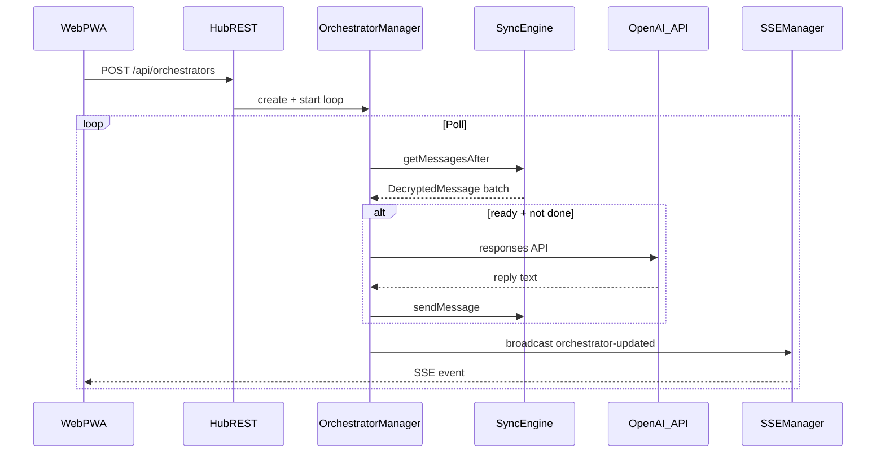

# Orchestrator on the web (first draft)

## Context

Today [`orchestrator/main.py`](d:\Work\hapi\orchestrator\main.py) runs as a standalone process: hub JWT/MCP for `send_message` and `get_messages_after`, OpenAI Responses API for replies and completion checks, and a poll loop keyed off the agent **ready** event. The web PWA ([`web/`](d:\Work\hapi\web)) already uses TanStack Router/Query and SSE ([`web/src/hooks/useSSE.ts`](d:\Work\hapi\web\src\hooks\useSSE.ts)). Hub exposes authenticated REST under `/api/*` via [`hub/src/web/server.ts`](d:\Work\hapi\hub\src\web\server.ts). `SyncEngine` already has [`getMessagesAfter`](d:\Work\hapi\hub\src\sync\syncEngine.ts) and [`sendMessage`](d:\Work\hapi\hub\src\sync\syncEngine.ts) suitable for an in-process port of the loop.

## Recommended architecture

**Secrets:** OpenAI API key only on create body; stored only in server memory with orchestrator state; never returned from GET/list.

**State:** In-memory orchestrator registry (hub restart drops runs). Optional guardrails: max poll iterations and/or history cap (align with risks in prior plan).

**SSE:** Add a new `SyncEvent` variant in [`shared/src/schemas.ts`](d:\Work\hapi\shared\src\schemas.ts) (this package is `@hapi/protocol`). Include `namespace` and `sessionId` on the event so [`SSEManager.shouldSend`](d:\Work\hapi\hub\src\sse\sseManager.ts) delivers to the same subscribers as other session-scoped events (avoid relying only on `connection.all`).

**OpenAI:** Hub has no `openai` dependency in [`hub/package.json`](d:\Work\hapi\hub\package.json); use `fetch` to the Responses API (same logical calls as `ProxyBrain` in Python).

## Fork / upstream merge strategy

- **Bulk logic** in new files: e.g. [`hub/src/sync/orchestratorManager.ts`](d:\Work\hapi\hub\src\sync\orchestratorManager.ts), [`hub/src/web/routes/orchestrators.ts`](d:\Work\hapi\hub\src\web\routes\orchestrators.ts), new [`web/src/routes/orchestrators/`](d:\Work\hapi\web\src\routes\orchestrators) and components.
- **Minimal edits to shared “hot” files:** one new discriminated union member in [`shared/src/schemas.ts`](d:\Work\hapi\shared\src\schemas.ts) (upstream may also touch this—conflicts possible but localized).
- **Minimal hub wiring:** one `app.route` line in [`hub/src/web/server.ts`](d:\Work\hapi\hub\src\web\server.ts), constructor/wiring in [`hub/src/index.ts`](d:\Work\hapi\hub\src\index.ts).
- **Web:** new routes under [`web/src/router.tsx`](d:\Work\hapi\web\src\router.tsx) plus one nav entry where other top-level links live.
- **Do not modify** [`orchestrator/main.py`](d:\Work\hapi\orchestrator\main.py) for this feature; it remains the CLI/offline path.

Alternative (if merge sensitivity dominates): keep Python orchestrator and add a tiny **sidecar HTTP** service + web UI that talks only to that service; hub diff approaches zero but you own deployment, auth, and real-time UX.

## API sketch (hub)

| Method | Path | Purpose |
|--------|------|--------|
| POST | `/api/orchestrators` | Body: `sessionId`, `openaiApiKey`, `model`, optional `openaiBaseUrl`, `systemPrompt`, `sessionGoal`, optional poll tuning. Validates session in namespace; starts loop. |
| GET | `/api/orchestrators` | List public status for namespace. |
| GET | `/api/orchestrators/:id` | Status + non-secret fields. |
| GET | `/api/orchestrators/:id/transcript` (optional) | Bounded in-memory history for UI if not folded into GET. |
| PATCH | `/api/orchestrators/:id` | `pause` / `resume`. |
| DELETE | `/api/orchestrators/:id` | Stop and remove. |

Follow the same JWT + namespace patterns as [`hub/src/web/routes/sessions.ts`](d:\Work\hapi\hub\src\web\routes\sessions.ts) / [`hub/src/web/routes/messages.ts`](d:\Work\hapi\hub\src\web\routes\messages.ts).

## Web UX (MVP)

- **`/orchestrators`:** list with status, link to detail.
- **`/orchestrators/new`:** session picker (reuse sessions query), masked API key, model, goal + system prompt, submit.
- **`/orchestrators/:id`:** status, pause/resume/stop, transcript; subscribe to new SSE type and update TanStack Query cache (mirror patterns in [`useSSE.ts`](d:\Work\hapi\web\src\hooks\useSSE.ts) for session events).

## Port fidelity notes

- Reuse Python helpers conceptually: `_unwrap_role_content`, `should_respond` (ready detection), `generate_reply`, `is_task_done`, batch processing then act—see [`orchestrator/main.py`](d:\Work\hapi\orchestrator\main.py) `MimicProxyAgent` and `ProxyBrain`.
- **Validate** ready-event shape against live `DecryptedMessage.content` from the hub (same risk as standalone script).

## Test plan

- `bun typecheck` (root).
- `bun run test` (root).
- Manual: create orchestrator, confirm SSE delivery with correct namespace/session subscription, confirm API key never appears on GET, DELETE stops polling.

## Out of scope for this draft

- Persisting orchestrators across hub restarts (SQLite).
- Running OpenAI or the loop in the browser.
