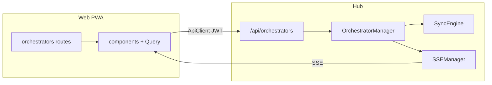

# Orchestrator in the HAPI web app (web-first)

## Decision: Option A (hub-native)

The control plane **runs inside the hub**: REST on **`/api/orchestrators`**, orchestration loop uses **`SyncEngine.getMessagesAfter` / `sendMessage`** in-process, OpenAI via **`fetch`** (no new hub dependency). Realtime updates use the **existing SSE connection** with a **new `SyncEvent` variant** (see [`shared/src/schemas.ts`](d:\Work\hapi\shared\src\schemas.ts), [`hub/src/sse/sseManager.ts`](d:\Work\hapi\hub\src\sse\sseManager.ts) `shouldSend` rules—include `namespace` and `sessionId` on events). **No Python HTTP sidecar** for this feature.

## Goal

Ship a **first-class Orchestrator experience inside the existing PWA** ([`web/`](d:\Work\hapi\web)): same layout and components users already know. [`orchestrator/main.py`](d:\Work\hapi\orchestrator\main.py) stays the **reference behavior** and **CLI/offline** path; it is **not** modified for this work.

## What already exists (no web UI yet)

- Orchestrator config and **`initial_message`**: env / `.env` + hardcoded string in [`orchestrator/main.py`](d:\Work\hapi\orchestrator\main.py).
- Web stack: [`web/src/router.tsx`](d:\Work\hapi\web\src\router.tsx), ApiClient, TanStack Query, [`useSSE.ts`](d:\Work\hapi\web\src\hooks\useSSE.ts), components under [`web/src/components/`](d:\Work\hapi\web\src\components).

## UI: reuse existing building blocks

| Area | Reuse |
|------|--------|
| Structure / chrome | Route patterns like sessions/settings; [`useAppGoBack`](d:\Work\hapi\web\src\hooks\useAppGoBack.ts) where appropriate |
| Forms | [`NewSession`](d:\Work\hapi\web\src\components\NewSession) patterns (sections, selectors, primary actions) |
| Actions | [`ActionButtons`](d:\Work\hapi\web\src\components\NewSession\ActionButtons.tsx), [`ui/button`](d:\Work\hapi\web\src\components\ui\button.tsx) |
| Feedback | [`LoadingState`](d:\Work\hapi\web\src\components\LoadingState.tsx), [`Spinner`](d:\Work\hapi\web\src\components\Spinner.tsx), [`useToast`](d:\Work\hapi\web\src\lib\toast-context.tsx), [`ConfirmDialog`](d:\Work\hapi\web\src\components\ui\ConfirmDialog.tsx) |
| List / status | [`ui/badge`](d:\Work\hapi\web\src\components\ui\badge.tsx), [`ui/card`](d:\Work\hapi\web\src\components\ui\card.tsx); cues from [`SessionList`](d:\Work\hapi\web\src\components\SessionList.tsx) |
| Session picking | Existing sessions query; link to `/sessions/$id` |
| Transcript | Scrollable panel; [`MarkdownRenderer`](d:\Work\hapi\web\src\components\MarkdownRenderer.tsx) when content is markdown; clear role labels |
| Secrets | Masked API key input; **never** store OpenAI key in `localStorage`; send on create only |

**Screens (MVP)**

1. **`/orchestrators`** — list runs, status badges, link to detail, “New” CTA.
2. **`/orchestrators/new`** — **initial message**, **session goal**, **system prompt**, model, optional base URL, masked API key, session picker.
3. **`/orchestrators/:id`** — status, pause / resume / stop, transcript; live updates via **hub SSE** (`orchestrator-updated` or chosen type name); optional lightweight refetch on focus as fallback.

## Hub implementation (targets)

| Piece | Location |
|-------|----------|
| Loop + OpenAI | New [`hub/src/sync/orchestratorManager.ts`](d:\Work\hapi\hub\src\sync\orchestratorManager.ts) |
| REST | New [`hub/src/web/routes/orchestrators.ts`](d:\Work\hapi\hub\src\web\routes\orchestrators.ts); register in [`hub/src/web/server.ts`](d:\Work\hapi\hub\src\web\server.ts) |
| Lifecycle | Construct manager in [`hub/src/index.ts`](d:\Work\hapi\hub\src\index.ts); pass `getSyncEngine` + callback to broadcast `SyncEvent` |

Secrets: API key **in memory** on the hub process only; never returned from GET/list.

## API shape (`/api/orchestrators`)

| Method | Path | Purpose |
|--------|------|--------|
| POST | `/api/orchestrators` | `sessionId`, `initialMessage`, `openaiApiKey`, `model`, optional `openaiBaseUrl`, `systemPrompt`, `sessionGoal`, optional poll tuning |
| GET | `/api/orchestrators` | List public status |
| GET | `/api/orchestrators/:id` | Detail without secrets |
| GET | `/api/orchestrators/:id/transcript` | Optional bounded history |
| PATCH | `/api/orchestrators/:id` | `pause` / `resume` |
| DELETE | `/api/orchestrators/:id` | Stop |

Auth: same JWT + namespace rules as [`hub/src/web/routes/sessions.ts`](d:\Work\hapi\hub\src\web\routes\sessions.ts).

## Fork / upstream merge (Option A)

- **Web:** mostly new files under `web/src/routes/orchestrators/`, `web/src/components/Orchestrator/`, hooks.
- **Shared + hub:** `SyncEvent` extension + route registration + manager—expect occasional **merge conflicts** on upstream pulls; keep orchestration logic in **dedicated files** to limit edits to `server.ts` / `index.ts` to a few lines.

## Behavioral fidelity

Mirror [`orchestrator/main.py`](d:\Work\hapi\orchestrator\main.py): parsing, **ready** detection, reply generation, task-done check, batch-then-act. Validate **ready** against live `DecryptedMessage.content`.

## Test plan

- `bun typecheck`, `bun run test`.
- Manual: create from UI; SSE updates detail; GET never exposes API key.

## Out of scope

- SQLite persistence for orchestrators (hub restart drops runs).
- Running the loop or OpenAI in the browser.
